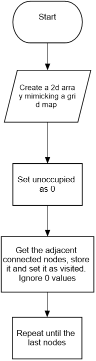

# Breadth First Search

## Theory 

The motivation of graph search is to check a network is connected or not. 
Example of shortest path - Driving direction  
A generic graph search algo finds all the vertices connected to the node (for directed graphs, search in forward direction only).  

In BFS, a reference vertices is noted. The adjacent nodes of it is stored in FIFO queue. This process repeats until the last adjacent node.

 
